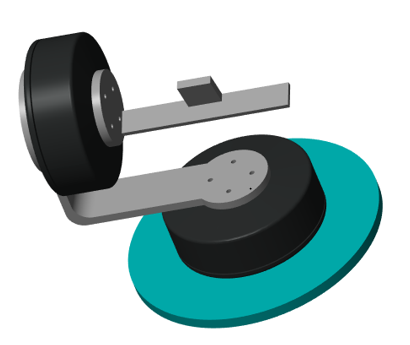
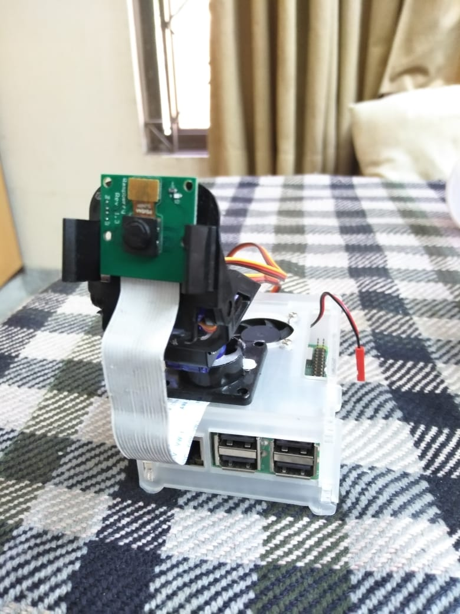
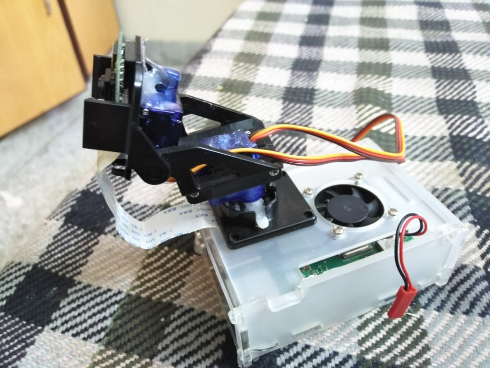
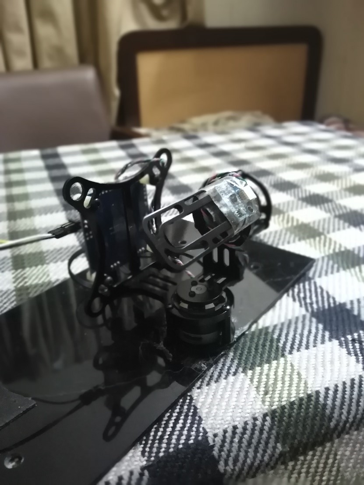

# Gimbal-based-Robotic-Eye-Design-for-Fast-Moving-Stimulus-Detection

In dynamic social environment, fast eye ball movement in robotic eye is much needed to recognize
and track the fast moving stimulus. For tracking of fast moving stimulus, high decoupling ratio of
camera sensor from the head skeleton is required. Two axis gimbal system is used to achieve high
decoupling ratio. Mathematical modeling of gimbal system is done by considering the torque
disturbances and dynamic unbalance. For efficient tracking and independent eye movement in
the bumpy environment, stabilization control system is designed. Non-linear System equations
are linearized using Jacobain matrix to achieve linear state space equations. The overall model
is simulated on the Simulink with CAD model of the gimbal and proportional integral derivative
(PID) controller is used for the system. Simulation results confirms the tracking of the stimulus
object.

## 3D CAD Model of 2 axis gimbal for MATLAB Simulink simulation

  

### Simulink Simulation of YAW Axis Step Response of Gimbal https://www.youtube.com/watch?v=uA5-d7-RH-Y
### Simulink Simulation of PITCH Axis Step Response of Gimbal https://www.youtube.com/watch?v=SsKMqfEnkuc
## Prototype Raspberry PI implementation of FPV Gimbal

  

  

## Real Time Implmentation of Algorithms on BGC 2.0 Gimbal

  

### Project demo video  https://youtu.be/xHHwAmC-rAc  

### Ping Pong Ball Detection and Tracking Demo https://youtu.be/P4KbkO4UtrA
